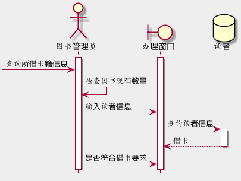
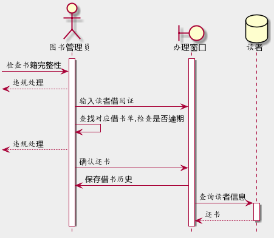
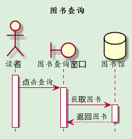
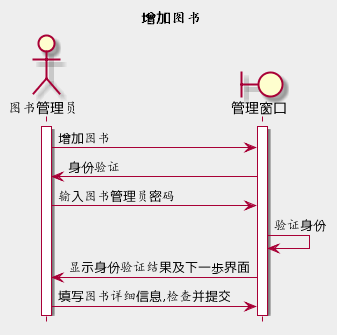
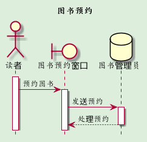

# 实验四 图书管理系统顺序图绘制


## 4.1借书

4.1.1代码：

```
@startuml
skinparam backgroundColor #eee
hide footbox
actor 图书管理员
boundary 办理窗口
database 读者
activate 图书管理员
activate 办理窗口
[-> 图书管理员: 查询所借书籍信息
图书管理员 -> 图书管理员: 检查图书现有数量
图书管理员 -> 办理窗口: 输入读者信息
办理窗口 -> 读者: 查询读者信息
activate 读者
读者 --> 办理窗口: 借书
deactivate 读者
图书管理员 -> 办理窗口: 是否符合借书要求
@enduml

```



## 4.2还书

4.2代码

```
@startuml
skinparam backgroundColor #eee
hide footbox
actor 图书管理员
boundary 办理窗口
database 读者
activate 图书管理员
activate 办理窗口
[-> 图书管理员: 检查书籍完整性
[<-- 图书管理员: 违规处理
图书管理员 -> 办理窗口: 输入读者借阅证
图书管理员 -> 图书管理员: 查找对应借书单,检查是否逾期
[<-- 图书管理员: 违规处理
图书管理员 -> 办理窗口: 确认还书
办理窗口 -> 图书管理员: 保存借书历史
办理窗口 -> 读者: 查询读者信息
activate 读者
读者 --> 办理窗口: 还书
deactivate 读者
@enduml
```



## 4.3图书查询

4.3代码

```
@startuml
title 图书查询
skinparam backgroundColor #ded
hide footbox
actor 读者
boundary 图书查询窗口
database 图书馆
activate 读者
读者 -> 图书查询窗口: 点击查询
activate 图书查询窗口
图书查询窗口 -> 图书馆: 获取图书
activate 图书馆
图书馆 --> 图书查询窗口: 返回图书
deactivate 图书馆
@enduml

```



## 4.4增加图书

4.4代码

```
@startuml
skinparam backgroundColor #eee
title 增加图书
hide footbox
actor 图书管理员
boundary 管理窗口
activate 图书管理员
activate 管理窗口
图书管理员->管理窗口: 增加图书
管理窗口->图书管理员: 身份验证
图书管理员->管理窗口: 输入图书管理员密码
管理窗口->管理窗口: 验证身份
管理窗口->图书管理员: 显示身份验证结果及下一步界面
图书管理员->管理窗口: 填写图书详细信息,检查并提交
@enduml

```



## 4.5图书预约

4.5代码

```
@startuml
title 图书预约
skinparam backgroundColor #ded
hide footbox
actor 读者
boundary 图书预约窗口
database 图书管理员
activate 读者
读者 -> 图书预约窗口: 预约图书
activate 图书预约窗口
图书预约窗口 -> 图书管理员: 发送预约
activate 图书管理员
图书管理员 --> 图书预约窗口: 处理预约
deactivate 图书管理员
@enduml
```

